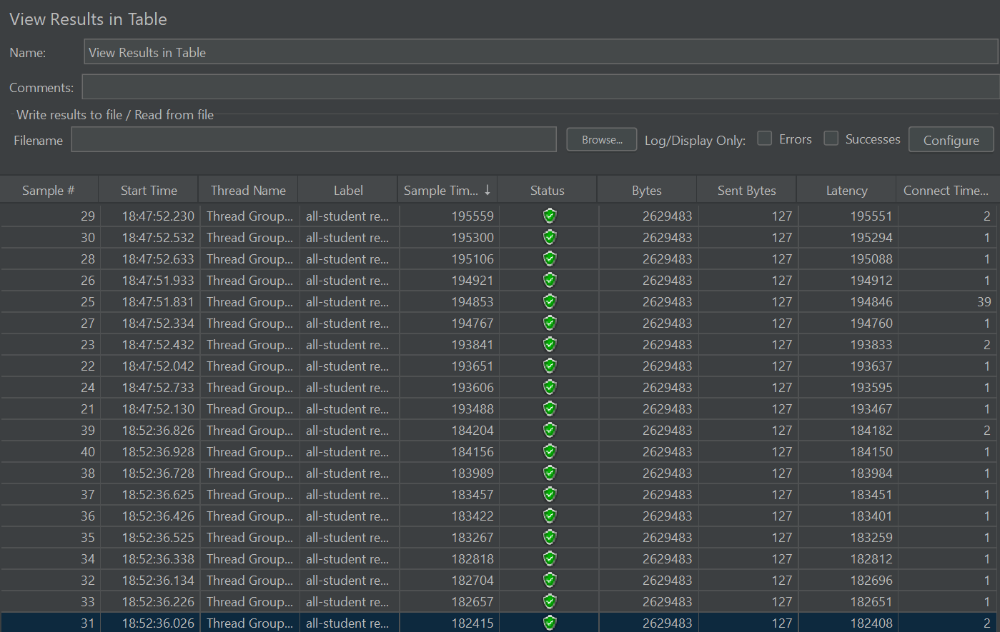
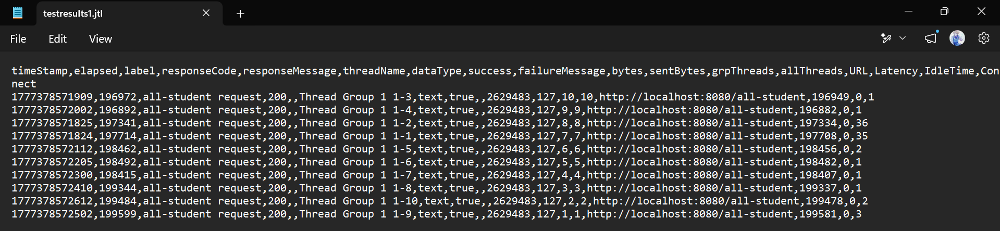
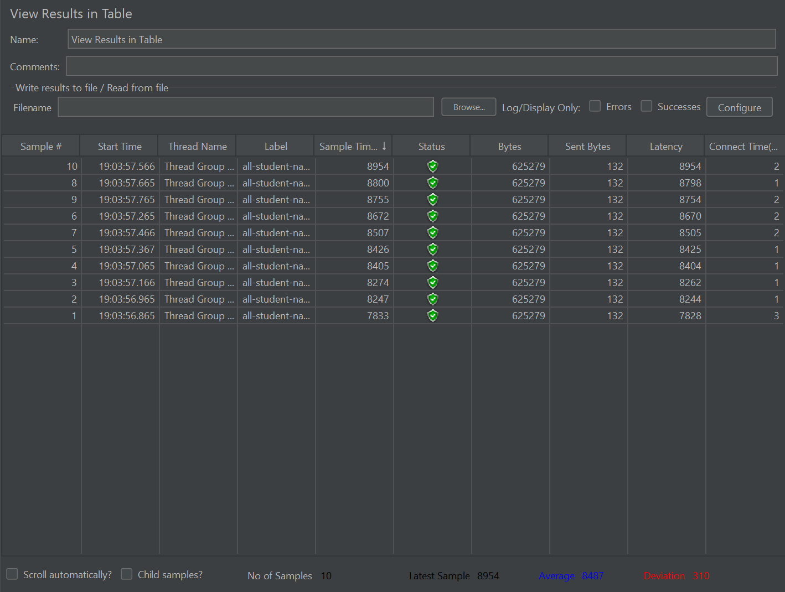
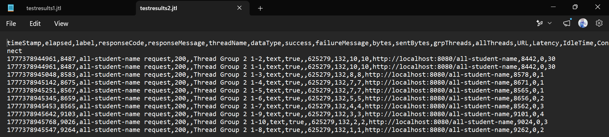
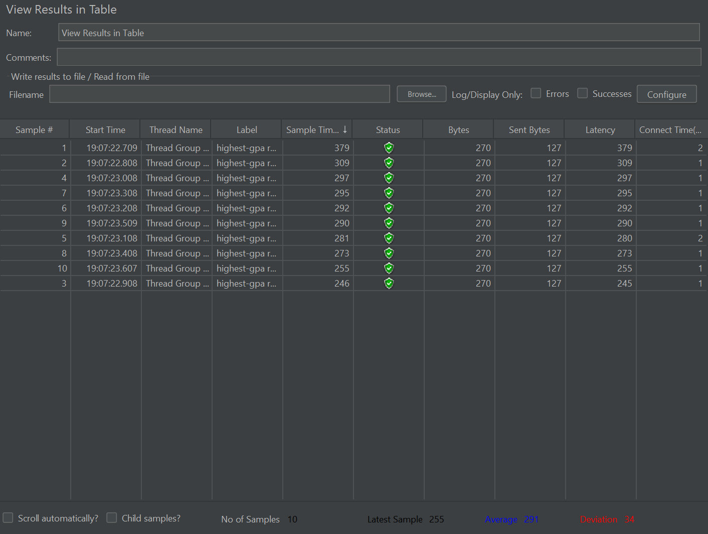
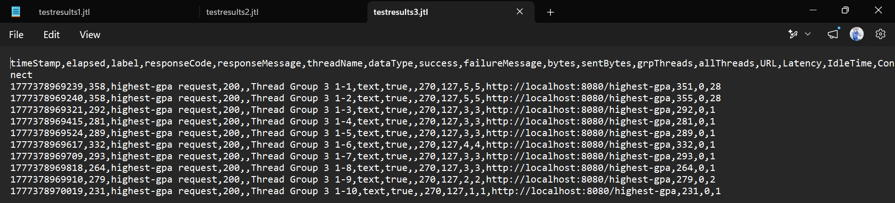
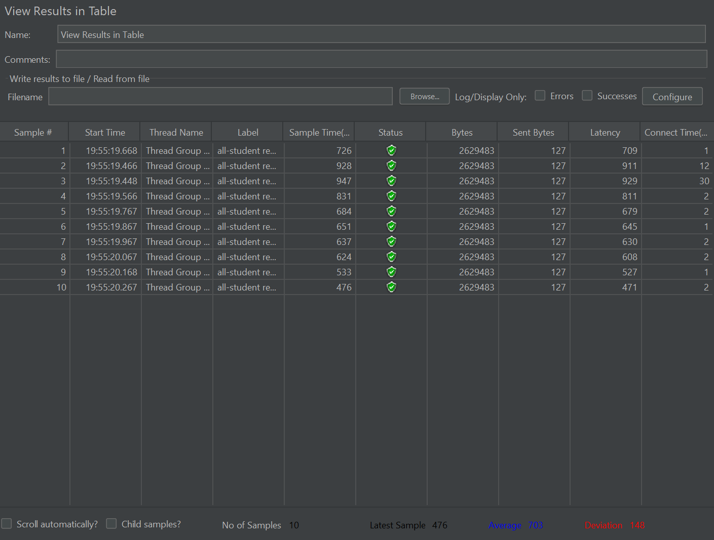
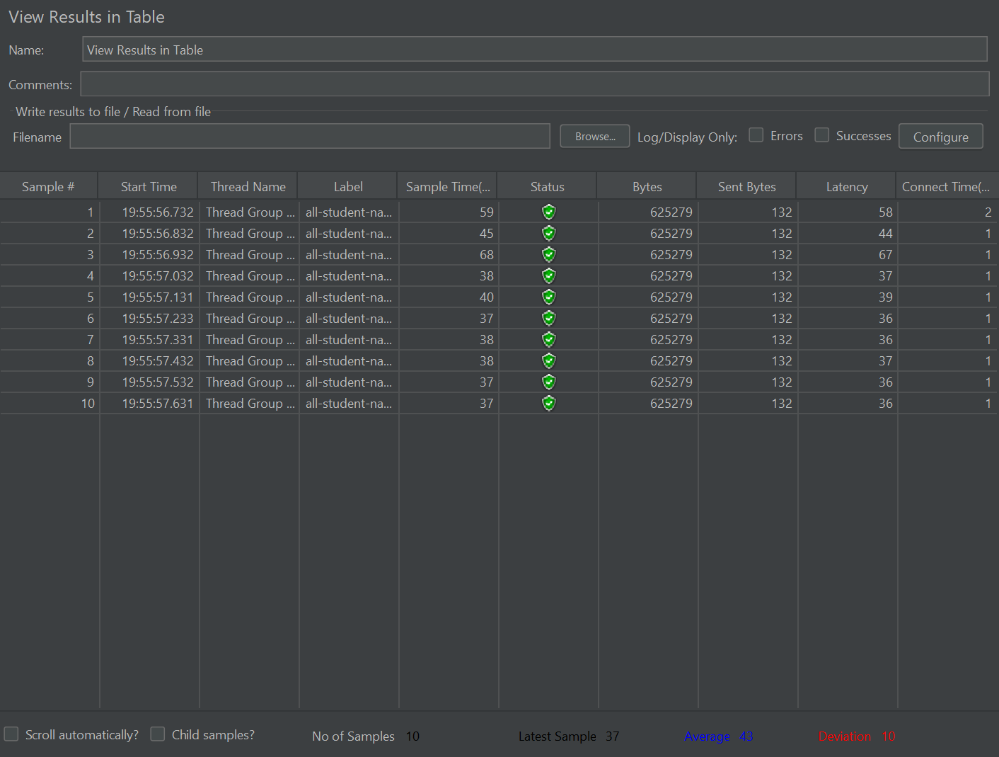
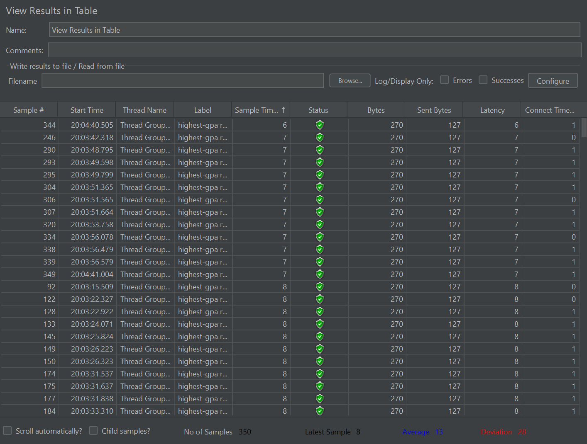

Testing awal GUI dan CLI

### Test 1: All Students Endpoint (`/all-student`)

**JMeter CLI result:**

### Test 2: All Student Names Endpoint (`/all-student-name`)

**JMeter CLI result:**

### Test 3: Highest GPA Endpoint (`/highest-gpa`)

**JMeter CLI result:**

Perbandingan setelah optimisasi

### Test 1: All Students Endpoint (`/all-student`)

**After:**

Query yang dioptimalkan mengurangi pemanggilan berulang dengan mengambil data yang dibutuhkan dalam satu query database.

### Test 2: All Student Names Endpoint (`/all-student-name`)

**After:**

Query nama yang dioptimalkan menghindari pemuatan entity yang tidak perlu dan hanya mengembalikan nama mahasiswa.

### Test 3: Highest GPA Endpoint (`/highest-gpa`)

**After:**

Pencarian GPA tertinggi sekarang menangani nilai yang sama dengan aman dan mengembalikan satu hasil yang deterministik.

### Conclusion

Optimisasi ini meningkatkan waktu respons dengan mengurangi overhead query dan membatasi pekerjaan database pada setiap endpoint.

Reflection

1. JMeter dipakai untuk menguji performa aplikasi dari sisi pengguna, misalnya melihat response time, throughput, dan error rate saat diberi beban. IntelliJ Profiler dipakai untuk menganalisis kode dari sisi internal, misalnya melihat method yang paling banyak memakan waktu atau memori. Jadi, JMeter menunjukkan gejala performa, sedangkan IntelliJ Profiler membantu menemukan penyebabnya di level kode.

2. Proses profiling membantu saya melihat bagian kode yang paling sering dipanggil, paling lambat, atau paling boros resource. Dari sana saya bisa mengetahui titik lemah aplikasi, misalnya query yang terlalu sering ke database atau method yang melakukan pekerjaan berulang.

3. Ya, IntelliJ Profiler cukup efektif untuk menemukan bottleneck di kode aplikasi. Profiler memberi gambaran yang lebih detail tentang alur eksekusi dan beban tiap method, sehingga saya lebih mudah menentukan bagian mana yang perlu dioptimalkan terlebih dahulu.

4. Tantangan utamanya adalah memahami hasil pengujian, membedakan bottleneck yang nyata dari noise, dan memastikan optimisasi tidak mengubah perilaku aplikasi. Saya mengatasinya dengan membandingkan hasil JMeter dan profiling, melakukan perubahan kecil yang terukur, lalu memvalidasi hasilnya dengan menjalankan ulang aplikasi dan pengujian.

5. Manfaat utama IntelliJ Profiler adalah membantu saya menemukan hotspot kode dengan cepat, memahami alokasi waktu eksekusi, dan memprioritaskan optimisasi yang paling berdampak. Tool ini juga membantu saya mengurangi tebakan saat mencari penyebab lambatnya aplikasi.

6. Jika hasil profiling IntelliJ Profiler tidak sepenuhnya sama dengan hasil JMeter, saya menganggap keduanya saling melengkapi. JMeter menunjukkan dampak performa pada skenario beban, sedangkan profiler menunjukkan sumber masalah di kode. Saya kemudian mengecek konteks eksekusi, mengulangi pengujian, dan melihat apakah perbedaannya muncul karena beban, data, atau jalur kode yang berbeda.

7. Strategi optimisasi yang saya lakukan adalah mengurangi query yang tidak perlu, memakai query yang lebih efisien, dan menghindari pemanggilan berulang ke database. Setelah perubahan dibuat, saya memastikan fungsionalitas tetap aman dengan menjalankan kembali aplikasi, mengecek endpoint, dan membandingkan hasil sebelum dan sesudah optimisasi.

